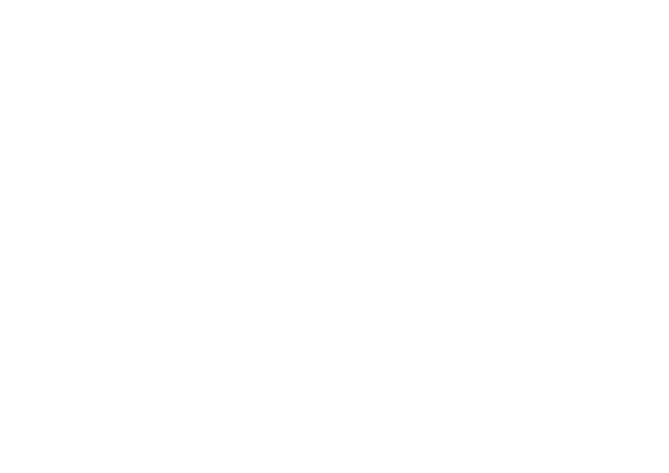

# **Javascript framework testing**
Project started on *02/10/2022*.

Finished: *TBD*.
## **About this repository**

**The purpose**
of this repository is to test and compare Javascript's
different frameworks and how they differ from eachother.
This also works as an introduction to JS frameworks since
I have no prior experience with them.

So if you are looking for a place to start and try them out,
you can feel free to clone and try out this repository.

**Tech** of this project is very basic and the only extra 
tool I used was [TailwindCSS](https://tailwindcss.com/).
You dont need to download Tailwind's CLI, because it is already
installed via the NodeJS and npm tools.

Although, if you want to change things in the HTML files and use
the Tailwind tools, you need to run the following command 
in the terminal:

```
npm run watch
```

So make sure you have installed 
[NodeJS](https://nodejs.org/en/) before editing!

**The inspiration / Reference** for this project came from the
[Fireship -Youtube channel](https://www.youtube.com/c/Fireship)
because of their video on 
[Different JS frameworks](https://www.youtube.com/c/Fireship).
I recommend watching that video as reference for this project.
## **Installation**

Install this project to your computer by cloning it via Git:

```bash
  git clone https://github.com/sakuexe/JavascriptFrameworkTesting.git
  cd JavascriptFrameworkTesting
```

Remember to also install NodeJS if you haven't already:

**Ubuntu**
```bash
  sudo apt install nodejs
  node --version
```

**Windows**:
[NodeJS website](https://nodejs.org/en/download/)
```bash
  node --version
```

**Chocolatey**:
```bash
  choco install nodejs
  node --version
```
## **Frameworks used**

The frameworks that I am trying out currently are the following:


More frameworks might be added and compared at a later date.

---



